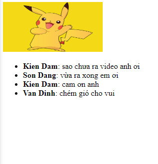

# Cho mảng users và mảng comments như sau:

```js
const users = [
    {
        id: 1,
        name: 'Kien Dam'
    },
    {
        id: 2,
        name: 'Son Dang'
    },
    {
        id: 3,
        name: 'Van Dinh'
    }
]

const comments = [
    {
        id: 1,
        user_id: 1,
        content: 'sao chưa ra video anh ơi'
    },
    {
        id: 2,
        user_id: 2,
        content: 'vừa ra xong em ơi'
    },
    {
        id: 3,
        user_id: 1,
        content: 'cam ơn anh'
    },
    {
        id: 4,
        user_id: 3,
        content: 'chém gió cho vui'
    }
]
```

Hiển thị danh sách comment như sau:

